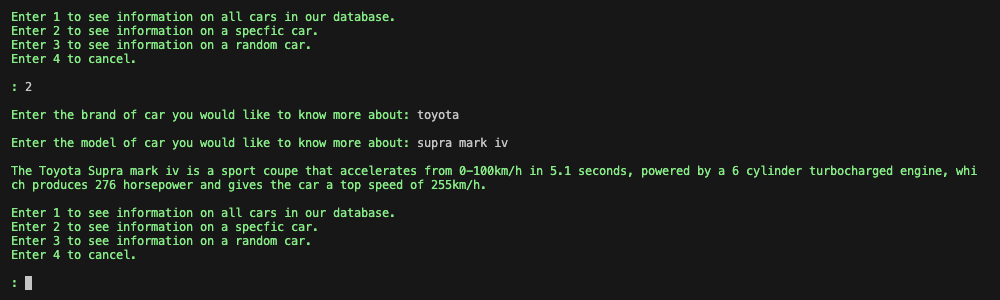

# Terminal Application: Gallo 24 Car Garage

Welcome! the following terminal application functions as a booking and information system for the Gallo 24 Car Garage. Users can add, remove and view vehicle bookings, as well as view information about vehicles in the Gallo 24 database, and finally play a guessing game trying to detirmine a vehicle based off of its metrics.

## Application Installation

### System Requirements:

The following programs are required on your Operating System to run this application. Any OS can run this application if the following are present:

    - Python 3
    - Git
    - Bash

### Installation Instruction:

1. If you are operating on windows, install the Windows Subsystem for Linux [(WSL)](https://learn.microsoft.com/en-us/windows/wsl/install).

2. On windows open a WSL terminal, or for other operating systems open a standard terminal.

3. Clone the git repository found [here](https://github.com/LouisMDenman/LouisDenman-T1A3) to an appropriate location on your machine, using the git clone command:
```sh
git clone git@github.com:LouisMDenman/LouisDenman-T1A3.git
```

4. Allow the system_checks.sh script to have execute permission and run the file as a script by entering the following command in the terminal:
```sh 
chmod +x system_checks.sh
```

5. Run the command:
```sh
./system_checks.sh
```

6. In the terminal, and the application should begin.

### Dependancies:

- Colored: Colored is an external package that is responsible for adding color to text-based terminal interfaces. The installation of this package is handled by the run_gallo_24_garage.sh, which is run in the process of starting the terminal application via the system_checks.sh script, as explained above.

## How To Use The Application

### Main Menu

When you first load into the application, you should be welcomed with the main menu, which can be seen below:


To access each of the features, you click the corresponding number on the keyboard with the number that is associated on the screen, so 1 for bookings, 2 for car information, 3 for the car guessing game, and 4 to exit the application. 

### Booking Features

Lets first inspect the booking features by pressing 1:


As we can see, there is a booking menu with different coloured text to distingush that we are in this new menu. The way we select each function within this feature is the same as how we select which feature we want in the main menu, so in this case 1 to add a booking, 2 to remove a booking, 3 to view booking/(s) and 4 to exit back to the main menu. 

#### Add Booking

Lets first add a booking in the system:


When 1 was entered, the application asked for a range of details from the user, and once all of these details are entered, the application gives an acknowledgement that the booking is confirmed. The booking menu then reappears below, ready for another function to be started. 

#### View Booking

Lets now see the booking we entered by selecting the view bookings function:


When 3 was entered, the application asked for the first and last name of the user, and once these details were entered, displayed all bookings associated with the name that was entered, which in our example shows 2 previous bookings plus the one we just booked. Once again, when this has occured, the booking menu reappears below, ready for another function.

#### Remove Booking

To remove the booking we just entered, lets utilise the remove booking function.


When 2 was entered, the application asked for multiple details about the booking that the user wants to delete, and asks these specific details to ensure that there is enough information to distinguish between similar bookings. Once the user has entered these details, the application ackowledges that the booking has been removed, and the booking menu reappears ready for further input once again.

#### Exiting The Booking Feature

Now that we are finished with all of the booking functions in the booking feature, we simply input 4 to exit back to the main menu.


### Car Information Features

Lets now look at the car information feature of the application, which can be selected by entering 2 at the main menu:


Once again we are greeted with a unique menu for this different feature, which has different coloured text and a new set of options from 1 to 4 for selecting functions of this feature.

#### View All Car Information

Lets first enter 1 to see the information on all cars within the application:


As we can see above, when this function is chosen, we get an extensive list of all the cars and their information from the application displayed, with the car information menu down the bottom ready to recieve further input.

#### View Specific Car Information

Lets now enter 2 to see information on a particular car of our choosing:



When 2 was entered, the application asked for the brand and model of a car, and when the user enters these details and the system contains information about them, it outputs the information followed as always by the relevant menu below.

#### View Random Car Information

Lets now enter 3, so that we can see information on a random car within the application:


When 3 was entered, the application automatically selects a random car and its information, and displays this information immediately to the user. Following this is the car information menu ready for more input.

#### Exiting The Car Information Feature

Now that all of the functions within the car information feature have been used, exiting the feature is the same as the main menu and booking feature, all that is required is to enter 4:


### Car Guesser Features

By selecting 3 on the main menu of the application, we can inspect the car guesser feature menu:


When we do so, another unqiue menu with distinct color and options appears, with 1 being the option to play the car guesser game or 2 to exit back to the main menu. Lets play the game by entering 1!

#### Car Guesser

Once 1 is entered, the game is immediately commenced, and the user is given a short prompt to guess what car is associated with the information being displayed. Every 5 turns, another hint is revealed, making the guess easier, until 5 hints have been revealed at which point the game will continually ask the user to try again until they correctly guess or quit the game. In the first example below, the user correctly guesses the vehicle after 9 guesses and doesn't need all the prompts:


Whereas the next example shows all the prompts and the users quitting as they are unsure of what the answer is:


When the game is finished, the car guesser menu will always reappear, meaning to play again users once again click 1.

#### Exiting the Car Guesser Feature

To exit the car guesser feature, as described in the menu, users have to input 2:


### Warning Messages

Within the application, there are messages that can sometimes be triggered to let the user know that there is an issue or an issue has occured. These messages appear in red, with the exception of the goodbye message on the main menu, which is also red but simply signifies the application closing:


Lets go through these messages below, so you are aware of what they mean if you get them:

#### Exit Game Prompt

This prompt occurs when a users chooses to quit out of the car guesser game, and is red so that the user can distinguish that they have exited the game and are no longer playing. This prompt can be seen in the final image within the Car Guesser section.

#### Menu Misinput Prompt

When users enter any kind of input that isn't one of the options available in the main menu or sub menus, a warning prompt will appear as seen below, and the menu will reappear waiting for correct input.


#### Future Date Prompt

When Users are adding or removing a booking, they are required to enter a date for the booking. If they enter a date that is in the past, the function will issue a red prompt message asking for input again and alerting the user that a date in the present or future needs to be entered, as seen below:


#### Function Misinput Prompt

Within the booking and car information features, there are some functions that require user input to match pre-existing information. If entered user information does not match pre-existing information, the application will provide a prompt explaining that there is no matching information in the system.


#### Guesser Game Unavailable Prompt

If there is some issue with the files involved in the car guesser game, there is potential that the application will create a file with information on only one car. If this occurs, when trying to play the car guesser game, you will instead be greeted with a message that begins with 'sorry, it looks like most of our database is unavailable for some reason,' and finishes with the information on the one car. If this is occuring, it would be best to uninstall and reinstall the application.


#### CSV File Doesn't Exist Prompt

If the files that hold the information the functions require don't exist, you will recieve a warning message that states a particular csv file does not exist. This should never happen since there are earlier preventative measures within the code to make sure that these files do exist on startup, but if you are getting this error, it would be best to uninstall and reinstall the application.

#### General Error Prompt

If you recieve a general warning prompt that states 'Apologies, something went wrong' you have encounted an error unanticipated by the application. This also shouldn't ever happen since there are extensive countermeasures in place, but if it does occur it prevents the application from completely crashing.